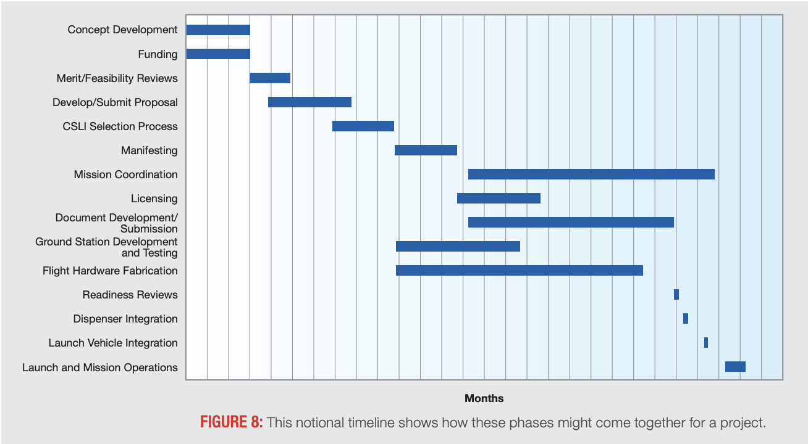

# SEDS at UMD 

Repository for the software team of the SEDS org at the University of Maryland.

## Resources
### Recommended Readings
 - NASA's CubeSat videos [1](https://youtu.be/HZMiJ_Q47qk), [2](https://youtu.be/BLJBVkLVGHE), and [3](https://youtu.be/pnRdIyIWI0k)
 - NASA's [CubeSat 101](https://www.nasa.gov/sites/default/files/atoms/files/nasa_csli_cubesat_101_508.pdf)
 - The [Wikipedia page](https://en.wikipedia.org/wiki/CubeSat) on CubeSats provides a high-level overview. Here is an excerpt of the paragraph most relevant to us.

> Like larger satellites, CubeSats often feature multiple computers handling different tasks in parallel including the attitude control (orientation), power management, payload operation, and primary control tasks. COTS attitude control systems typically include their own computer, as do the power management systems. Payloads must be able to interface with the primary computer to be useful, which sometimes requires the use of another small computer. This may be due to limitations in the primary computer's ability to control the payload with limited communication protocols, to prevent overloading the primary computer with raw data handling, or to ensure payload's operation continues uninterrupted by the spacecraft's other computing needs such as communication. Still, the primary computer may be used for payload related tasks, which might include image processing, data analysis, and data compression. Tasks which the primary computer typically handles include the delegation of tasks to the other computers, attitude control (orientation), calculations for orbital maneuvers, scheduling, and activation of active thermal control components. CubeSat computers are highly susceptible to radiation and builders will take special steps to ensure proper operation in the high radiation of space, such as the use of ECC RAM. Some satellites may incorporate redundancy by implementing multiple primary computers, this could be done on valuable missions to lessen the risk of mission failure. Consumer smartphones have been used for computing in some CubeSats, such as NASA's PhoneSats.

 - This [paper](https://arxiv.org/pdf/1902.04117) describes a radiation hardened design
 - This [paper](resources/cubesatpaper.pdf) give an overview of CubeSat missions - from desin to operation
 - NASA's CubeSat [design specifications](https://static1.squarespace.com/static/5418c831e4b0fa4ecac1bacd/t/56e9b62337013b6c063a655a/1458157095454/cds_rev13_final2.pdf)
 - A [list of CubeSats](https://en.wikipedia.org/wiki/List_of_CubeSats)
 - Launch initiative [resources](https://www.nasa.gov/content/cubesat-launch-initiative-resources) by NASA

## Timeline

The following is the timeline recommended by NASA.

